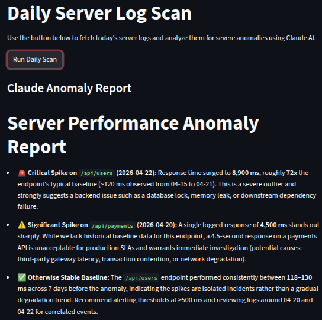

# Daily Server Log Scan Pipeline

An automated Data Engineering pipeline that replaces manual log analysis with AI-driven anomaly detection. It extracts daily metrics from a PostgreSQL database, leverages Claude 3.5 Sonnet to identify statistical outliers, and surfaces actionable insights via a live Streamlit dashboard.



## Architecture Overview

### Phase 1: Database Layer
- **Supabase** stores the `server_logs` table and serves as the project database.
- `pipeline.py` connects securely using environment variables and extracts the latest daily logs.
- This layer handles data retrieval, schema access, and raw log collection.

### Phase 2: Reasoning Agent
- **Claude API** drives anomaly analysis using the `anthropic` Python package.
- The project sends cleaned, formatted log data to the `claude-3-7-sonnet-20250219` model.
- Claude identifies severe anomalies, explains why they are important, and returns a focused 3-bullet-point markdown report.

### Phase 3: UI Dashboard
- **Streamlit** provides a lightweight, user-friendly dashboard.
- `pipeline_streamlit.py` exposes a **Run Daily Scan** button that executes the pipeline on demand.
- The app then displays Claude’s anomaly report in a readable markdown panel.

## Getting Started

1. Create and activate the Python virtual environment:
   ```bash
   python -m venv .venv
   source .venv/bin/activate
   ```

2. Install dependencies:
   ```bash
   pip install -r requirements.txt
   ```

3. Add your secrets to `.env`:
   ```env
   SUPABASE_URL=your_supabase_project_url
   SUPABASE_KEY=your_supabase_anon_key
   ANTHROPIC_API_KEY=your_anthropic_api_key
   ```

4. Run the Streamlit application:
   ```bash
   streamlit run pipeline_streamlit.py
   ```

## Project Files

- `pipeline.py` — core extraction and Claude anomaly analysis logic
- `pipeline_streamlit.py` — Streamlit dashboard for user-triggered scans
- `requirements.txt` — Python dependencies
- `.env` — local secret configuration (ignored by Git)
- `optional_deployment/daily_scan_template.yml` — GitHub Actions template for scheduled automation

## Phase 4: Optional Automation

This repository can be extended into a fully automated daily scan using GitHub Actions.

- The `optional_deployment/daily_scan_template.yml` file contains a daily cron workflow.
- Add GitHub Secrets for `SUPABASE_URL`, `SUPABASE_KEY`, and `ANTHROPIC_API_KEY` in your repository settings.
- Once enabled, the workflow can run `pipeline.py` every day and provide unattended anomaly monitoring.
